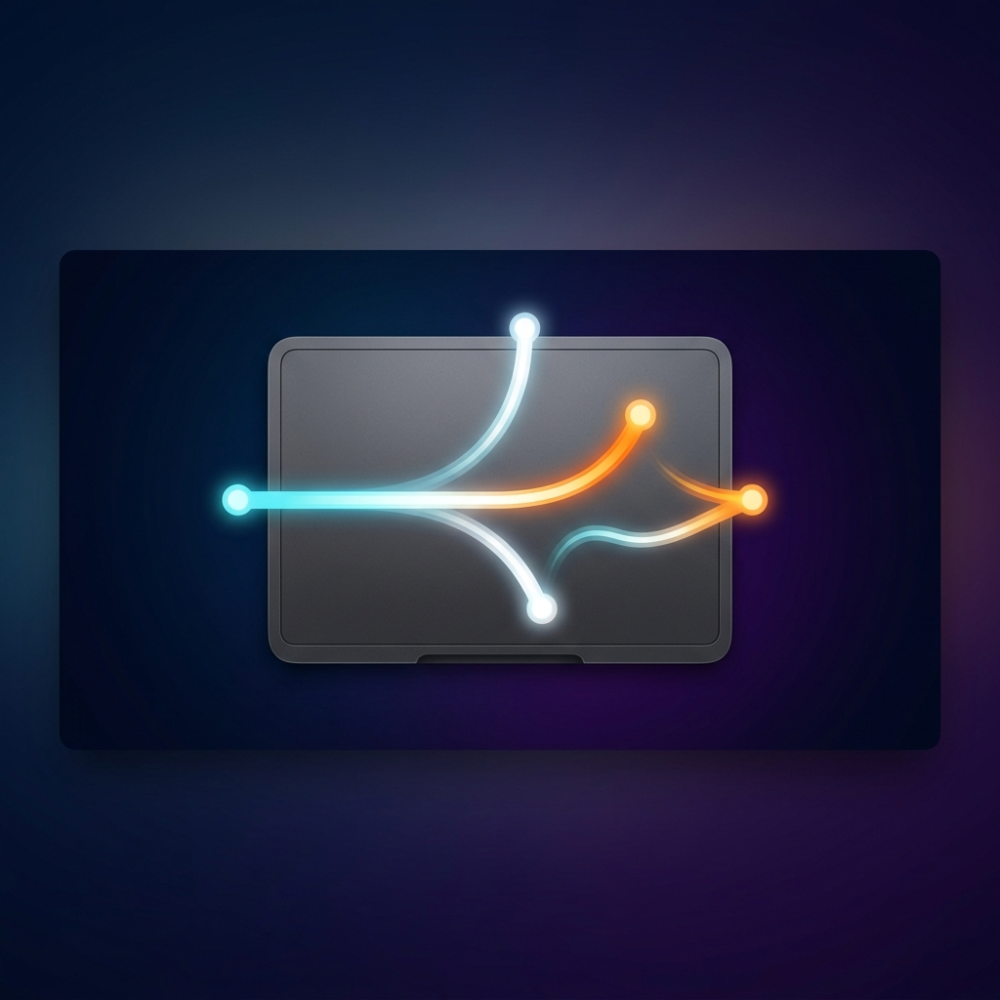

<p align="center">
  
</p>

<h1 align="center">Glide</h1>

<p align="center">
  <b>Supercharge your trackpad. Control your Mac the way it was always meant to feel.</b><br>
  Swipe with 2–5 fingers to manage windows, switch apps, and trigger system actions —<br>
  at any speed, with zero false positives.
</p>

<p align="center">
  
  
  
  
  
</p>

---

> **"I've been using BetterTouchTool for years. Glide just... works better on the trackpad. The palm rejection alone is worth the switch."**

---

## What Is Glide?

Glide is a free, open-source macOS menu bar app that replaces the built-in trackpad gesture system with one that's faster, smarter, and fully yours to configure.

Instead of macOS's fixed four-finger gestures, Glide intercepts raw multitouch data directly from your trackpad hardware and maps every combination of **finger count**, **direction**, and **speed** to any action you choose — window snapping, app switching, fullscreen, screenshots, and more.

It lives quietly in your menu bar, uses no background CPU when idle, and recovers automatically after sleep. There's no subscription, no cloud, no tracking. Just better trackpad control.

---

## Table of Contents

- [Why Glide?](#why-glide)
- [Quick Start](#quick-start)
- [How It Works](#how-it-works)
- [Speed-Based Gestures](#speed-based-gestures)
- [Palm Rejection & Safe Zones](#palm-rejection--safe-zones)
- [Reciprocal Gestures](#reciprocal-gestures)
- [Default Gesture Map](#default-gesture-map)
- [All Available Actions](#all-available-actions)
- [Customization & Preferences](#customization--preferences)
- [Tuning Guide](#tuning-guide)
- [App-Specific Rules](#app-specific-rules)
- [Troubleshooting](#troubleshooting)
- [Building from Source](#building-from-source)
- [Architecture Overview](#architecture-overview)

---

## Why Glide?

Your Mac's trackpad is one of the best input devices ever made. The software controlling it, not so much.

macOS ships with a handful of hard-coded gestures you can't change. Third-party tools either cost money, bloat your system, or trigger gestures accidentally when you rest your palm. Glide was built to solve all of that:

| | macOS Built-in | Most Alternatives | **Glide** |
|--|:--:|:--:|:--:|
| Fully customizable | ❌ | ✅ | ✅ |
| Speed-based actions | ❌ | ❌ | ✅ |
| Intelligent palm rejection | ⚠️ | ⚠️ | ✅ |
| Reciprocal (undo) gestures | ❌ | ❌ | ✅ |
| App-specific rules | ❌ | ✅ | ✅ |
| No subscription | ✅ | ❌ | ✅ |
| Open source | ❌ | ❌ | ✅ |
| Zero dependencies | — | ❌ | ✅ |

---

## Quick Start

```bash
git clone https://github.com/Vatsal057/Glide.git
cd Glide
bash build.sh
open build/Glide.app
```

macOS will prompt for **Accessibility** permission — Glide needs it to control windows and simulate keys. Grant it in **System Settings → Privacy & Security → Accessibility**, and you're done. Three-finger swipes work immediately.

> **Optional:** Move Glide to your Applications folder and enable **Launch at Login** in Preferences so it's always there when you need it.
>
> ```bash
> cp -r build/Glide.app /Applications/
> ```

---

## How It Works

Glide taps directly into Apple's `MultitouchSupport` private framework to receive raw per-finger contact data from your trackpad — the same low-level stream the system itself uses. This gives Glide access to finger position, velocity, pressure, and contact shape on every frame.

When you place multiple fingers on the trackpad, here's what happens internally:

```
  Your Trackpad                     Glide Engine
  ─────────────                     ─────────────────────────────────────
  ● ● ●  ──────►     ──────►    1. Count fingers (3)
                                 2. Check Safe Zones (palm rejection)
                                 3. Verify swipe vs. pinch (coherence check)
                                 4. Detect direction  (→ Right)
                                 5. Classify speed    (Normal)
                                 6. Look up matching rule
                                 7. Fire action       (App Switcher: Next)
                                 8. Issue haptic pulse
```

The entire pipeline runs on the main thread with a watchdog timer that automatically restarts the multitouch bridge if hardware goes stale — for example, right after your Mac wakes from sleep.

---

## Speed-Based Gestures

This is Glide's most distinctive feature, and once you start using it, you won't want to go back.

The **same** gesture — say, 3 fingers swiping right — can trigger **three different actions** depending on how fast your fingers move. You get triple the control without learning any new gestures.

| Speed | Feel | Velocity Threshold | Color |
|-------|------|--------------------|-------|
| 🔵 **Slow** | A deliberate, unhurried glide | ≤ 0.003 | Blue |
| ⚪ **Normal** | Your everyday comfortable swipe | 0.003 – 0.008 | Gray |
| 🟠 **Fast** | A sharp, snappy flick | ≥ 0.008 | Orange |

Speed is measured by averaging the centroid velocity across the first three frames of movement — so your *starting* speed is what matters, not your peak speed. This makes it consistent and intentional.

### Technique Tips

**🟠 Fast — "The Flick":** Think of it like flicking a crumb off a table. Place your fingers and snap them. The whole motion should take under a quarter second.

**⚪ Normal — "The Swipe":** Don't think about it. If you just swipe naturally, this is what fires.

**🔵 Slow — "The Glide":** Move like you're adjusting a dimmer switch. Deliberate, smooth, fingers staying in full contact.

> **Pro tip:** If you assign a Fast rule and a Normal rule to the same direction, the Normal rule acts as a fallback — it fires when the speed doesn't clearly match Fast. You can leave a direction without a Slow rule and it'll simply do nothing on a slow swipe.

---

## Palm Rejection & Safe Zones

Accidental gesture triggers from palm contact are the single biggest frustration with trackpad tools. Glide has a two-layer defense:

### Layer 1: Lifecycle Blocker

The instant any finger or palm touches the **outer margin** of the trackpad, Glide freezes gesture recognition entirely for that touch session. No gesture can start or continue once an edge contact is registered. You can rest your thumb on the corner of the trackpad and swipe freely with your other fingers — nothing will fire accidentally.

### Layer 2: Configurable Dead Zones

In **Preferences → Tuning**, four sliders let you define exactly how wide each edge margin is. The Preferences panel shows a live visual map of your trackpad with the safe area highlighted, so you can tune it precisely for your hand size and typing posture.

Swipes that *start* inside the safe area and slide toward the edge are correctly processed. Only contact that originates in the margin is blocked.

---

## Reciprocal Gestures

Glide remembers what it just did and lets you immediately undo it.

Swipe up to maximize a window — then swipe down and it restores to exactly the size it was before. Open Mission Control, then swipe down to dismiss it. Minimize all your apps, then swipe up to restore them. The reverse gesture has to happen while a **reciprocal token** is active (immediately after the original action, before you do anything else), so it never fires unexpectedly.

Pairs that support reciprocals:

| Action | Reverse |
|--------|---------|
| Maximize Window | Restore Window |
| Enter Fullscreen | Exit Fullscreen |
| Snap Left / Right / Corner | Restore Window |
| Minimize All | Restore Minimized |
| Mission Control | Dismiss |
| App Exposé | Dismiss |
| Show Desktop | Show Desktop (toggle) |

Reciprocals are enabled per-rule and can be turned off individually in Preferences if you prefer strict one-way actions.

---

## Default Gesture Map

Out of the box, Glide comes loaded with a sensible starting set. Everything is Normal speed unless noted.

### 3 Fingers

| Gesture | Action |
|---------|--------|
| Swipe → | Next App (App Switcher) |
| Swipe ← | Previous App (App Switcher) |
| Swipe ↑ | Mission Control |
| Swipe ↓ | Minimize All Apps |
| Click (tap) | Quit App Under Cursor |

### 4 Fingers

| Gesture | Action |
|---------|--------|
| Swipe ↑ | Maximize Window |
| Swipe ↓ | Restore / Un-maximize |
| Swipe ← | Snap: Left Half |
| Swipe → | Snap: Right Half |

### 5 Fingers

| Gesture | Action |
|---------|--------|
| Swipe ↑ | Enter Fullscreen |
| Swipe ↓ | Exit Fullscreen |
| Click (tap) | Lock Screen |

---

## All Available Actions

Glide covers the full range of things you'd want a gesture to do, organized into six categories. All actions fire with zero noticeable latency.

**App Control**
Quit App Under Cursor, Force Quit App Under Cursor, Quit Frontmost App, Hide App Under Cursor, Hide Other Apps, Open App (launch any app you choose)

**App Switching**
Next App (App Switcher), Previous App (App Switcher), Activate Next App, Activate Previous App

**Window State**
Minimize Window, Minimize All Apps, Restore Minimized Apps, Maximize Window, Restore Window, Close Window, Enter Fullscreen, Exit Fullscreen, Toggle Fullscreen, Cycle Windows (⌘`)

**Window Snapping**
Snap Left Half, Snap Right Half, Snap Top-Left, Snap Top-Right, Snap Bottom-Left, Snap Bottom-Right, Center Window, Move to Next Display

**macOS System**
Mission Control, App Exposé, Show Desktop, Launchpad, Spotlight, Notification Center, Lock Screen, Sleep, Screenshot (Area), Screenshot (Full)

**Meta**
Do Nothing (useful for intentionally disabling a direction)

---

## Customization & Preferences

Click the hand icon in your menu bar and open **Preferences** (or press ⌘,). The SwiftUI Preferences panel is divided into a few sections:

**Gestures tab** shows your full rule list grouped by finger count. Each rule is a row: pick finger count, direction, speed, and action. You can add as many rules as you like — the only constraint is that each combination of (fingers + direction + speed + app filter) can only have one action. Add a rule with the **+** button, delete it with the trash icon, and drag to reorder.

**Tuning tab** exposes the physics of gesture detection. You can adjust:
- Velocity thresholds for Slow and Fast speed bands
- Candidate frames (how many frames to analyze before committing)
- Activation threshold (minimum travel to count as a swipe)
- Pinch spread threshold (prevents zoom gestures from becoming swipes)
- Edge margin sizes for all four sides

**General tab** has haptic feedback toggle, window targeting mode (focused window vs. window under cursor), launch at login, and debug logging.

A **live trackpad visualizer** in the Tuning tab shows your current finger positions and the active edge margins in real time, so you can verify your settings while tuning.

---

## Tuning Guide

The defaults work well for most people. Here's when you might want to adjust them:

**"Fast gestures fire when I want Normal"**
→ Raise `Fast Velocity Threshold` from 0.008 to 0.010–0.014. Gives you more room to swipe before it's classified as Fast.

**"Slow never fires, everything is Normal"**
→ Raise `Slow Velocity Threshold` from 0.003 to 0.005–0.007. Broadens the slow band.

**"I don't care about speed, I just want reliable gestures"**
→ Set all your rules to **Any Speed** in the speed picker. One rule covers all three bands.

**"Gestures feel slightly delayed"**
→ Lower `Candidate Frames` to 2 and lower `Activation Threshold` to 0.010–0.012.

**"I get false swipes during pinch-to-zoom"**
→ Raise `Candidate Frames` to 4 and lower `Pinch Spread Threshold`.

**"Gestures fire when I rest my palm"**
→ Increase the **edge margin** sliders in the Safe Zone section. Start by raising all four to 0.10 and see if the false triggers stop.

---

## App-Specific Rules

Every gesture rule has an optional **App Filter** field. When set, the rule only fires if that specific app is currently active (frontmost). This lets you build per-app gesture workflows:

- 3-finger swipe right → "Next Tab" in Safari, "Next Track" in Spotify, "Next Slide" in Keynote
- 4-finger swipe down → "Close Panel" in Final Cut, "Minimize" everywhere else

To set an app filter, expand a rule in Preferences and click the **App** picker. Running apps appear in the list automatically. Rules without an app filter apply globally as fallbacks.

---

## Troubleshooting

### Gestures don't work at all
1. Confirm Accessibility permission is granted: **System Settings → Privacy & Security → Accessibility → Glide** should be toggled ON.
2. Try removing Glide from the list, re-adding it, and relaunching.
3. Rebuild from scratch: `bash build.sh && open build/Glide.app`

### Gestures stop working after sleep or display wake
Glide automatically schedules a cascade of restarts at +0s, +2s, +5s, and +10s after any wake notification — because different Mac models reinitialize trackpad hardware at different speeds. In most cases this is transparent. If gestures stay broken, quit Glide from the menu bar and relaunch it.

### Gestures fire in the wrong direction
Enable debug logging in **Preferences → General**, then swipe and look at the Console output. You'll see `angle=X°` in the log. Use this map to verify: Right ≈ 0°/360°, Up ≈ 90°, Left ≈ 180°, Down ≈ 270°. If your angle is halfway between directions (e.g. 45°), try swiping more precisely along one axis.

### Speed is always classified as Normal
If you've verified your velocity thresholds are correct and speed still isn't classifying right, enable debug logging to see the raw velocity values during your gesture. Adjust thresholds to match your actual movement speeds.

### App Switcher feels sticky or skips apps
Adjust `App Switcher Step Threshold` in Tuning. A lower value makes it step on smaller horizontal movement.

---

## Building from Source

### Requirements

- macOS 13 Ventura or later
- Xcode Command Line Tools: `xcode-select --install`
- Swift 5.9 or later (Swift 6.3 recommended)

No package manager, no CocoaPods, no SPM dependencies. The entire project is eight Swift source files and a build script.

### Build

```bash
git clone https://github.com/Vatsal057/Glide.git
cd Glide
bash build.sh
```

The build script compiles both `arm64` and `x86_64` slices and `lipo`s them into a universal binary, then bundles everything into `build/Glide.app`. The whole process takes under 30 seconds.

### Install permanently

```bash
cp -r build/Glide.app /Applications/
open /Applications/Glide.app
```

Then enable **Launch at Login** in Preferences so it starts automatically.

### Project structure

```
Glide/
├── Sources/
│   ├── main.swift               — Entry point
│   ├── AppDelegate.swift        — Menu bar, permissions, sleep/wake handling
│   ├── MultitouchBridge.swift   — Raw trackpad access via private MT framework
│   ├── GestureEngine.swift      — Core gesture pipeline (candidate → lock → fire)
│   ├── ActionExecutor.swift     — Window/app/system action dispatch
│   ├── Settings.swift           — Persistent settings, gesture rules, tuning params
│   ├── PreferencesUI.swift      — Full SwiftUI preferences panel
│   └── PreferencesWindow.swift  — NSWindow wrapper for SwiftUI panel
├── assets/
│   ├── hero.png
│   └── AppIcon.icns
├── Info.plist
├── Glide.entitlements
└── build.sh                     — Universal binary build script
```

---

## Architecture Overview

For contributors and the curious:

**MultitouchBridge** loads `MultitouchSupport.framework` at runtime via `dlopen` and registers a C callback for every multitouch frame. It handles device enumeration, retries when no devices are found (common right after wake), and proper callback unregistration on stop.

**GestureEngine** runs a state machine with five phases: `idle → candidate → lockedSwipe → fired → idle` (with `ignored` as a dead-end for non-swipe gestures). The candidate phase collects multi-frame evidence before committing — this is where pinch detection, coherence checking, edge blocking, and speed sampling happen. Once locked as a swipe, the engine watches for direction threshold crossing and fires the matched action.

**ActionExecutor** handles the actual macOS API calls: Accessibility API for window manipulation, CGEvent for key simulation, NSWorkspace for app control, and a saved-frame dictionary so maximize/restore can remember original window sizes.

**Settings** persists gesture rules and tuning parameters to `UserDefaults` as JSON, with a migration system for rule schema changes between versions.

---

## Contributing

Pull requests are welcome. If you're adding a new action, the minimal diff is: add a case to `GestureAction` in `Settings.swift`, handle it in `ActionExecutor.execute()`, and add it to `inverseAction` if it has a natural reverse.

For gesture engine changes, the debug logging system (enable in Preferences → General) is your best friend — it prints every phase transition, velocity sample, and classification decision to stdout.

---

<p align="center">
  <sub>
    Glide uses Apple's private <code>MultitouchSupport</code> framework for raw trackpad access.<br>
    Velocity-based speed detection inspired by <a href="https://github.com/taj-ny/InputActions">InputActions</a> by taj-ny.<br>
    MIT licensed — use it, fork it, make it yours.
  </sub>
</p>
