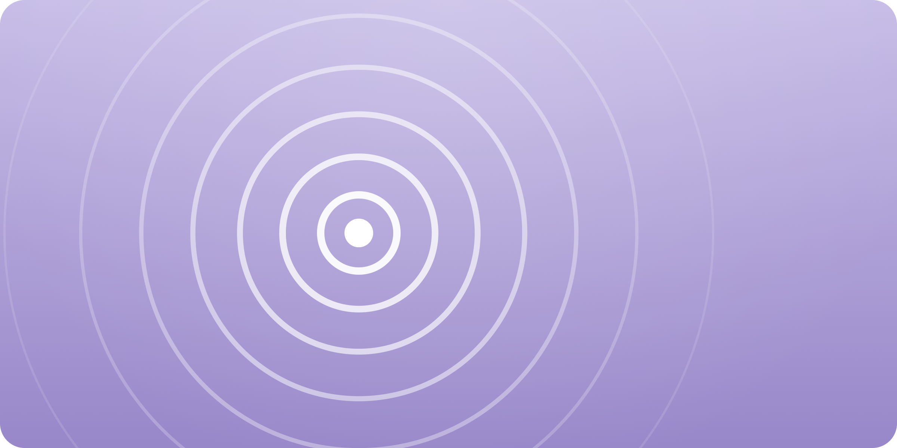

<div align="center">



# Glide

**Trackpad gestures for macOS — swipe, click, and force-click your way through windows, apps, and system controls.**

[](https://github.com/Vatsal057/Glide/releases/latest)
[](LICENSE)
[](#installation)

[Download](https://github.com/Vatsal057/Glide/releases/latest) · [Usage Manual](USAGE.md) · [Report an Issue](https://github.com/Vatsal057/Glide/issues)

</div>

---

Glide turns your trackpad into a control surface. Swipe with three, four, or five fingers to switch apps, snap windows, take screenshots, or run a shortcut — no memorizing key combos, no digging through menus. It runs quietly in the menu bar and reacts to touches in real time.

It also includes **Trackpad Edge Controls** that turn the outer physical rim of your trackpad into hardware sliders for volume and brightness, **TrackPoint** which turns a trackpad corner into a ThinkPad-style pointing stick, and a **visual App Switcher** you browse with a swipe instead of tapping ⌘Tab repeatedly.

Everything is configurable: which gesture does what, which app it applies to, how sensitive it is, and how hard you have to swipe to trigger it. Free, open source, and everything stays on your Mac — no network access, no analytics.

## Highlights

- 🎚️ **Trackpad Edge Controls** — slide a single finger along the physical rim of your trackpad to smoothly adjust Volume (right edge), Display Brightness (left edge), or custom actions (Keyboard Backlight, Mic Gain, Night Shift, App Switcher scrub) using native macOS OSD bezels with zero CPU overhead
- 🎬 **Animated Gesture Previews** — macOS Trackpad Settings-style live animations for every gesture in Preferences, complete with speed tiers (slow, normal, fast) and directional ghost trails
- 🖐️ **Swipes, clicks, and force-clicks** with 3, 4, or 5 fingers, each mappable to its own action
- 🪟 **Window management** — snap, maximize, center, move between displays, enter/exit fullscreen
- 🔄 **Visual App Switcher** — swipe to browse running apps and their windows, release to switch
- 📌 **TrackPoint** — a pointing stick in the corner of your trackpad, so you never have to lift your finger to reach the far side of the screen
- ⚡ **Speed-aware gestures** — a slow swipe and a fast flick in the same direction can do two different things
- 🎯 **Per-app rules, modifier keys, and window-state filters** — the same gesture can behave differently in Safari, when Shift is held, or when a window is already fullscreen
- ⌨️ **Global keyboard shortcuts** for any action, gesture or not
- 🎛️ **Deep tuning** — sensitivity, palm rejection, pinch/zoom conflict avoidance, all with a visual trackpad preview
- 🔒 **Private by design** — no telemetry, no network calls except checking GitHub for updates

Read the [full usage manual](USAGE.md) for every gesture, action, and setting Glide has.

## Installation

1. Download the latest **Glide-vX.Y.Z.dmg** from the [Releases page](https://github.com/Vatsal057/Glide/releases/latest).
2. Open the DMG and drag **Glide** into the **Applications** folder.
3. Glide is free and open source, so it isn't notarized by Apple, and macOS will warn you on first launch. To open it:

   - **Right-click** (or Control-click) Glide in Applications and choose **Open**, then click **Open** in the dialog.
   - On **macOS 15 (Sequoia) or newer**, if there's no Open option: double-click Glide once, then go to **System Settings → Privacy & Security**, scroll down, and click **Open Anyway**.
   - If macOS instead says the app is *"damaged and can't be opened"*, it isn't — that's just Gatekeeper. Run this one line in Terminal to fix it:

     ```sh
     xattr -cr /Applications/Glide.app
     ```

4. Open Glide and grant Accessibility access when prompted (**System Settings → Privacy & Security → Accessibility**). This is required — Glide reads trackpad touches and controls windows through it, and gestures won't fire without it.
5. The hand icon appears in your menu bar. A short welcome tour walks you through the starter gestures — you're ready to go.

**Requirements:** macOS 13 (Ventura) or later, Apple Silicon or Intel, a Multi-Touch trackpad (built-in or Magic Trackpad).

**Building from source:** clone the repo and run `./build.sh` (needs Xcode Command Line Tools). Add `--dmg` to also produce a DMG, or `--release` for a release build. Run `./build.sh --help` for the full list.

### Updating

You only do the steps above once. From then on Glide updates itself: open **Preferences → General** and click **Check for Updates**, or use **Check for Updates…** in the menu bar.

Glide downloads the new version, verifies it against the checksum published with the release, installs it over itself, and relaunches. Nothing to mount or drag, and no Gatekeeper warning to clear — that warning comes from the quarantine flag a browser attaches to downloads, and an in-app download doesn't get one.

## Quick start

A few gestures and edge controls come set up out of the box. Try them right away:

| Input | Action |
|---|---|
| **Slide 1 finger along right edge** | **System Volume up / down** |
| **Slide 1 finger along left edge** | **Display Brightness up / down** |
| Swipe up with 3 fingers | Mission Control |
| Swipe down with 3 fingers | Minimize all windows |
| Swipe up with 4 fingers | Maximize the active window |
| Swipe up again, on that same maximized window | Enter fullscreen |

> **Edge Controls tip:** Edge controls activate only when swiping directly along the outer physical rim of your trackpad. Normal cursor movements that cross or reach the edge are ignored, keeping your regular mouse navigation completely unaffected.

Everything is editable. Click the hand icon in your menu bar and choose **Open Preferences…** (or press ⌘, once the app is focused):
- Go to the **Edge Controls** tab to customize actions for the Top, Bottom, Left, and Right edges (including App Switcher scrub, Keyboard Backlight, Mic Gain, and Night Shift).
- Go to the **Gestures** tab to change what multi-finger gestures do, preview animated demonstrations with speed tiers, or add your own custom rules.

## Documentation

- **[Usage Manual](USAGE.md)** — every gesture type, action, filter, TrackPoint mode, tuning control, and config-file detail, explained.
- **[Design System](DESIGN.md)** — the visual language behind Glide's interface, for anyone contributing UI.

## Contributing

Issues and pull requests are welcome. If you're proposing a UI change, skim [DESIGN.md](DESIGN.md) first — Glide has a deliberately restrained visual style (native controls, one accent color, no glassmorphism) and PRs that drift from it will get bounced back for a pass.

## License

[MIT](LICENSE) — do what you want with it.
