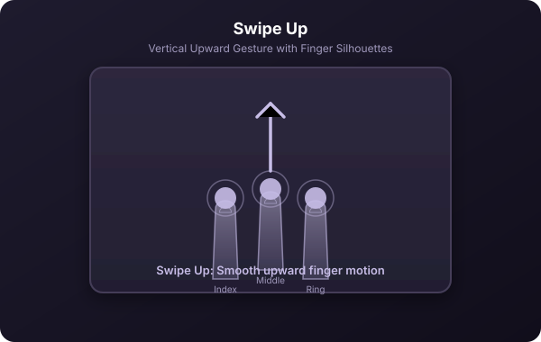
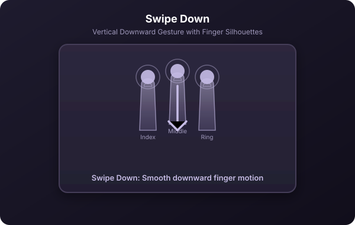
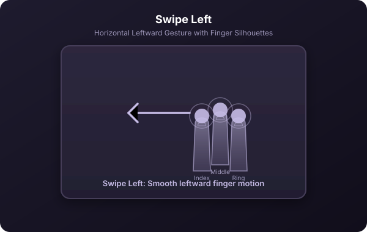
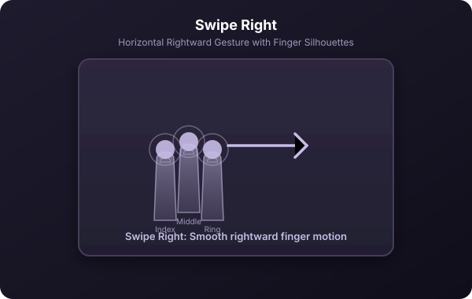
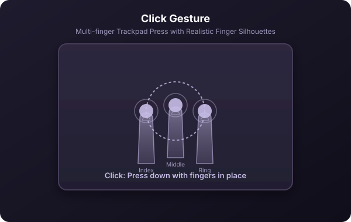
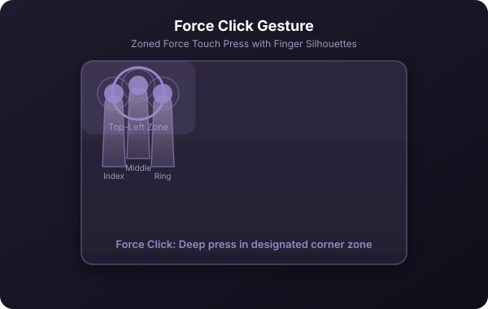
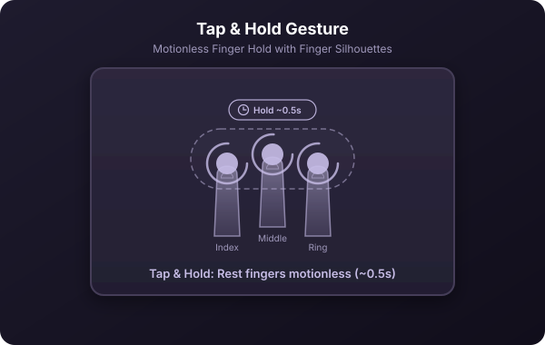
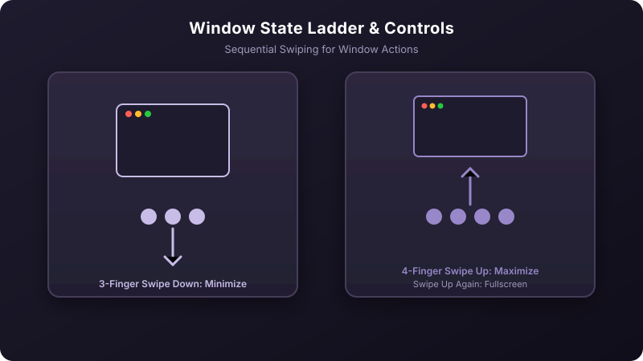

[← Back to manual](../USAGE.md)

# Core concepts

Instead of memorizing keyboard shortcuts, Glide lets you use trackpad movements. Open **Preferences → Gestures** to see and edit them. Every gesture is built from a few simple elements:

- **Finger count.** Gestures use **3**, **4**, or **5** fingers.
- **Gesture type:**
  - **Swipe** — sliding your fingers in a direction (**Up**, **Down**, **Left**, or **Right**).
      
      
  - **Click** — pressing down on the trackpad with all fingers in place, like a normal click but with more fingers down.
     
  - **Force Click** — pressing down harder on a Force Touch trackpad, past the normal click, for a second distinct action on the same fingers.
     
  - **Tap & Hold** — resting fingers motionless for a moment.
     
- **Swipe speed.** The same swipe direction can map to two different actions depending on how fast you move: **Slow**, **Normal**, or **Fast**. For example, a slow 3-finger swipe right could switch to the next window, while a fast flick right launches your browser. Speed only applies to swipes — clicks and holds don't have one.

  

Add a gesture with the **+** button in the Gestures list, then set its finger count, type, and action in the editor on the right. New gestures start as an inactive draft (shown with a pause icon) until you pick a real action.

If two gestures share the exact same trigger (same fingers, direction, speed, and filters), the one **lower in the list** wins — the list shows a warning icon on any gesture another one shadows.

---
[← Back to manual](../USAGE.md) · [Next: Smart filters & conditions →](02-filters-and-conditions.md)
