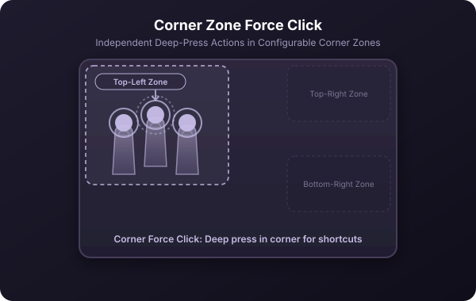

[← Back to manual](../USAGE.md)

# Smart filters & conditions

You don't have to use the same gesture for everything everywhere. Every gesture's editor has a **Conditions** section you can expand:

- **Keyboard modifiers.** Restrict a gesture to only fire while a specific key is held — **Command (⌘)**, **Shift (⇧)**, **Option (⌥)**, or **Control (⌃)** — or require that *no* modifier is held. Useful for stacking two behaviors on the same swipe (e.g. plain 3-finger swipe left/right browses apps; Shift + the same swipe does something else).
- **App filter.** Restrict a gesture to one specific app. A 3-finger click could close a tab in Safari but mute Spotify, using two separate rules each filtered to its own app.
- **Window state filter.** Change behavior based on the frontmost window's layout:
  - *Fullscreen* — filling the screen in native macOS fullscreen mode.
  - *Not Fullscreen*.
  - *Maximized* — resized to fill the screen but still showing the menu bar (not the same as native fullscreen).
  - *Not Maximized*.

  This is how the built-in gestures build a "ladder": swipe up once to maximize, swipe up again (now that the window is maximized) to go fullscreen. Same gesture, two window states, two outcomes.
- **Reciprocal (reverse) gestures.** For swipes, this lets the opposite direction undo the action — swipe up to maximize, swipe down right after to restore. Enabled by default for most actions that have a natural opposite (maximize ↔ restore, volume up ↔ down, next track ↔ previous). Turn it off, or pick a custom reverse action, in Conditions.
- **Corner zones (Force Click).** Restrict a Force Click to fire only when pressed inside a specific corner of the trackpad — **Top-Left**, **Top-Right**, **Bottom-Left**, or **Bottom-Right** — or allow it **Anywhere**. For example, the defaults map a top-left force click to full screenshot and top-right to area screenshot. 
- **Continuous gestures.** Left/right and up/down swipes can be set to *continuous*: instead of firing once, they run a begin → repeat → end sequence for as long as you keep your fingers down and moving. Good for scrub-style controls like volume or brightness, where you want the action to keep stepping while you swipe rather than firing once per gesture.

---
[← Previous: Core concepts](01-core-concepts.md) · [Back to manual](../USAGE.md) · [Next: Every action, explained →](03-actions.md)
