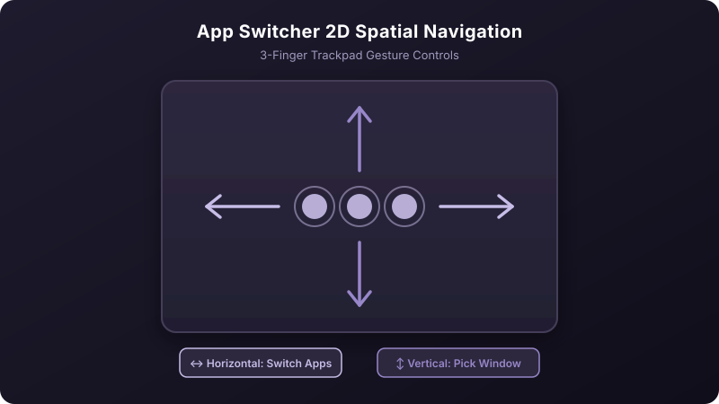
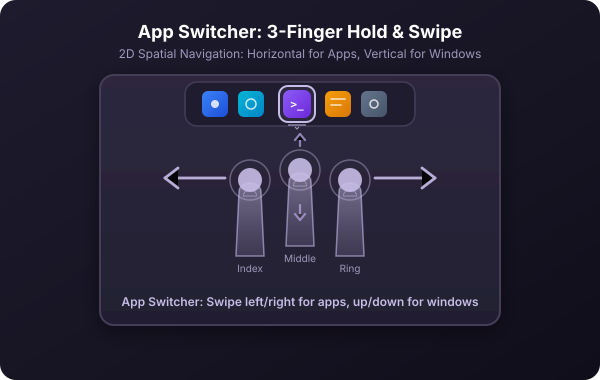

[← Back to manual](../USAGE.md)

# App Switcher

The App Switcher is a hold-and-swipe way to browse and jump between running apps — separate from the gesture rule list, and reserved on **3-finger left/right swipes** by default. Turn it on or off, and configure it, in **Preferences → App Switcher**.

**How it works:** swipe left or right with 3 fingers to browse apps, and release to switch — or lift all fingers without committing to cancel. (When using the **Newer** presentation style, if an app has multiple open windows, you can also swipe up or down to pick a specific window.)

  

### Why Vertical Swipes for Window Switching?

Standard macOS app switching (like native `⌘Tab`) only switches at the application level. If you have multiple Chrome windows, several Terminal sessions, or multiple documents open in the same app, switching to a specific window normally requires additional shortcuts (like `⌘\``) or opening Mission Control.

Glide introduces **2D spatial navigation**:
- **Horizontal swipes (left/right)** cycle through running applications.
- **Vertical swipes (up/down)** navigate through the "window deck" of the currently highlighted app.

This means you can target and switch directly to *any open window on your Mac* in a single fluid trackpad gesture.

### How to Use Window Switching

1. Make sure **Newer** presentation style is selected in **Preferences → App Switcher** (this is the default).
2. **Initiate the switcher:** Swipe left or right with 3 fingers and keep your fingers on the trackpad.
3. **Select an app:** Swipe left or right to highlight the app you want.
4. **Select a window:** If that app has multiple open windows, swipe **up or down** with 3 fingers to cycle through its window deck. Live window previews are shown if Screen Recording permission is granted (or window icons if not).
 
5. **Commit:** Release all fingers to focus the selected window immediately.
6. **Cancel:** Lift all fingers while outside or without selecting, or pause without committing.

**Two presentation styles:**
- **Newer** — Glide's custom overlay featuring 2D navigation (horizontal app browsing + vertical window selection) with live window thumbnails or app icons.
- **Legacy** — Converts your swipe directly into native `⌘Tab` events and lets macOS handle switching. Light on permissions and works on all macOS versions, but lacks custom overlays and per-window vertical selection.

Because it reserves the 3-finger horizontal swipe, any gesture you create on that same trigger needs a modifier key (like holding Shift) to coexist with it — the editor will tell you when this applies.

Other settings: skip Finder in the switcher when it has no open windows, restore minimized windows automatically when you select them, animate selection changes (off by default — it roughly doubles the CPU cost of a swipe), and two sliders for how far you need to swipe to step to the next app and how quickly repeated steps can happen.

---
[← Previous: Global keyboard shortcuts](04-keyboard-shortcuts.md) · [Back to manual](../USAGE.md) · [Next: TrackPoint →](06-trackpoint.md)
