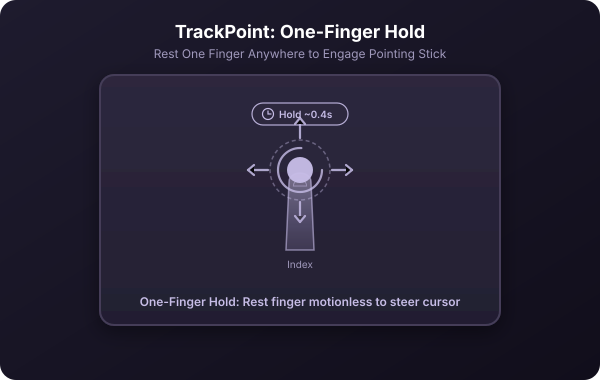
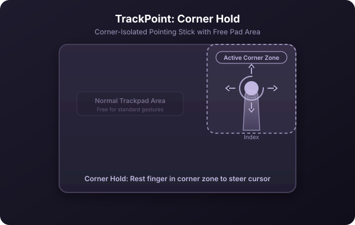
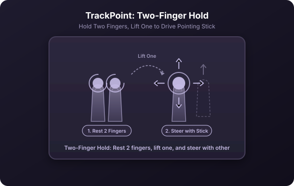
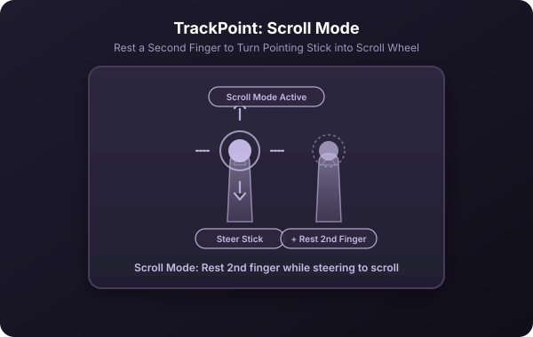

[← Back to manual](../USAGE.md)

# TrackPoint

TrackPoint turns a patch of your trackpad into a pointing stick, like the red nub in the middle of a ThinkPad keyboard. Instead of your finger's *position* mapping directly to cursor position — the way a trackpad normally works — your finger's *displacement from where it landed* maps to cursor *velocity*. Lean left and the cursor moves left for as long as you hold the lean; ease back toward center and it slows down. That's why a fingertip-sized patch of trackpad can move the cursor across the entire screen without your finger ever having to lift and reset. Turn it on and configure it in **Preferences → TrackPoint**.

**Why you'd want it:** reaching the far corner of a large or multi-monitor screen normally takes multiple relative swipes. With TrackPoint engaged, you just keep leaning your finger in a direction and the cursor keeps going.

**Activation modes** — how you tell Glide "I want to drive the cursor now" versus "I'm just using the trackpad normally":

| Mode | How you engage it |
|---|---|
| Double-Tap & Hold *(default)* | Tap once with one finger, tap again, and hold. The double tap is deliberate enough that you can't trigger it by accident just resting a finger on the pad.  |
| One-Finger Hold | Rest one finger anywhere on the pad and hold still for a moment.  |
| Corner Hold | Rest one finger in a corner you pick, and hold still for a moment. Keeps the rest of the trackpad free for normal use.  |
| Two-Finger Hold | Rest two fingers anywhere and hold still; lift one and the remaining finger becomes the stick.  |

Whichever mode you use, a short hold ("hold to engage") is what tells Glide you're committing to the stick rather than starting an ordinary drag or swipe — move too far before the hold completes and Glide steps aside, leaving the touch to macOS untouched.

**Once engaged:**
- Push your finger in a direction; the cursor accelerates that way. Ease off toward the anchor point and it decelerates. This continues as long as the finger stays down.
- Rest a **second finger** anywhere on the pad (if scrolling is enabled) to turn the stick into a scroll wheel instead of a cursor — the same role the middle button plays on a real TrackPoint. 
- Lift the finger to disengage and hand control back to macOS.
- A soft haptic tick confirms engagement and release, if haptics are enabled.

**Tunable feel:** top speed, how far the finger has to travel to reach it (push distance), a dead zone around the anchor so a resting finger doesn't drift, and an acceleration curve exponent (higher values keep small pushes slow for fine control while still reaching full speed on a bigger lean). Corner-mode users can also set which corner and how large its zone is, visually, in the preferences pane.

---
[← Previous: App Switcher](05-app-switcher.md) · [Back to manual](../USAGE.md) · [Next: Tuning & precision controls →](07-tuning.md)
